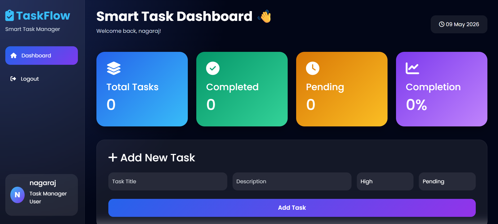

# Smart Task Management System

## Features
- User Authentication
- PostgreSQL Integration
- REST APIs
- Analytics Dashboard
- Responsive Bootstrap UI
- Pandas & NumPy Analytics

## Run Project

### Create Database
CREATE DATABASE taskdb;

### Install Packages
pip install -r requirements.txt

### Run
python app.py

# Screenshots

## Login Page


---

## Register Page


---

## Dashboard



---

## Add Task


---

## Edit Task


## Clone Repository

```bash
git clone https://github.com/khajjinagaraj9805-maker/taskflow-smart-task-manager.git